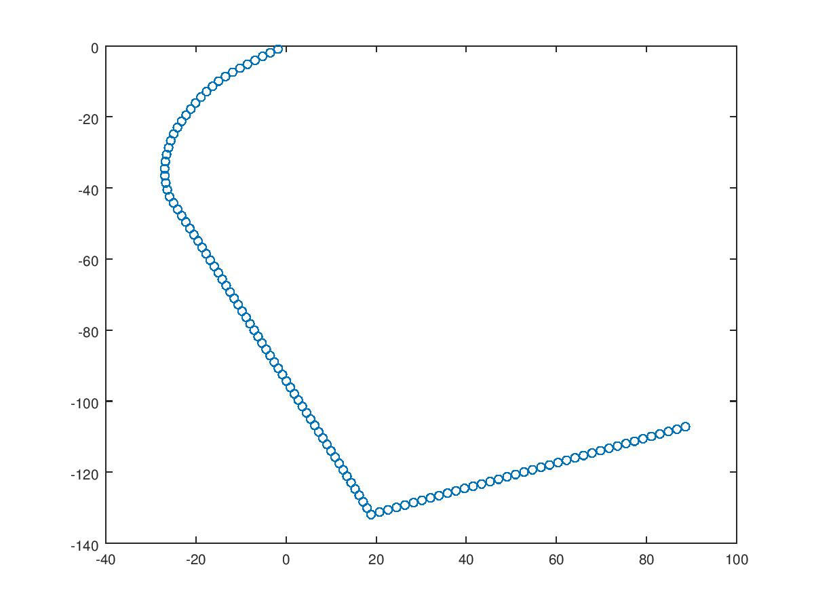

# MapperBot

## Idea

The objective is to make a robot that can create a map of the *space* it is exploring.

In a first instance, the plan is to simply log the data (i.e., the coordinates of the objects/walls) to an SD card. Future upgrades might involve more complex operations, such as passing the information to a more powerful platform (for ex., a RaspberryPi) which, based on the information it receives, may issue orders to the robot. A RaspberryPi might identify properties of the *space* (distinguish rooms, tables, et cetera), and use pathfinding techniques to traverse it intelligently.

Other (more inexpensive) possibility is to create a desktop or mobile based app that can receive input from the robot via WI-FI, and even issue commands to the robot (for example, go to the point with coordinates {x,y}). This is the alternative to be implemented in this project.

## Determining the current position

The idea is to avoid using GPS/GLONASS in this project. Not only those modules are expensive, but are *inaccurate* for our needs. When used together, the accuracy of those systems is of about 2 meters: good enough for cars, but not for rooms.

Instead, this project will use a [inertial navigation system](https://en.wikipedia.org/wiki/Inertial_navigation_system), as many rocket systems do. This system will calculate the (X,Y) coordinates of the robot using the following two modules:

- QMC5883L 3-axis magnetometer
- A rotary encoder

As it may be expected, the robot will have wheels. As it is also expected, the wheels are round, then they have a circumference. A rotary encoder will basically fire an interrupt when it has moved one tick forward or backward (in this case, we are using a 20 step rotary encoder). Therefore, circumference/n. of steps is the distance covered by the robot with each tick of the rotary encoder. This is enough to know the distance covered by the robot.

With the magnetometer, we can obtain the current heading of the robot. Therefore, it should be easy to update its current position every time the interrupt of the rotary encoder is fired.

  

In the plot above there is a real example of the system in use.

## Movement

We will be using a L293D and two DC motors to move the robot. This convenient 2 H bridge gives us the ability to independently control the movement of each motor, both in forward and in reverse.

## Mapping

The robot will use a ultrasonic sensor to detect obstacles. The idea is that, when a obstacle is detected, the robot will rotate 360 degrees while saving all other obstacles in the range of the ultrasonic sensor (<4 meters). Then, the robot will try to go the farthest it could go in a straight line (basically, in the direction of the farthest obstacle). 

This idea seems to work on paper, but a few considerations might be needed to be taken into account when choosing the next direction of movement, so as to avoid looping between positions. One possibility is to randomize the *quadrant* (NE, NW, SE, SW) to be used for determining the next direction.

## WiFi

This [library](https://github.com/ekstrand/ESP8266wifi) will be of utmost utility for configuring and using the ESP8266 chip. The idea is to establish a TCP connection with an desktop or mobile based application. This app will receive the coordinates of the obstacles identified by the robot, and may allow the user to issue commands to a robot.

## Requirements

To sum up, this project will be using the following components:

- Arduino UNO
- QMC5883L 3-axis magnetometer
- 20 step rotary encoder
- 2 DC Motors w/wheels
- L293D
- SD card module
- HC-SR04 ultrasonic sensor
- ESP8266 Wifi module

## Some issues

- SoftwareSerial will NOT work correctly with a high baud rate (for example, w/the default 115200 of the ESP8266). To change this, I removed the atmega328 from the Uno, connected the ESP8266 and used the AT command "AT+UART_DEF=9600,8,1,0,0".
- There seems to be an issue when receiving data from other device. This is critical, as we want to be able to command the robot remotely. Sending works just fine. 
	* As the author says in the code, for some reason some time should be allowed prior to reading the next byte from serialIn. Using SoftwareSerial as a debug stream seems to be a good enough hack. The main I/O stream is the standard hardware serial on the Arduino UNO.

